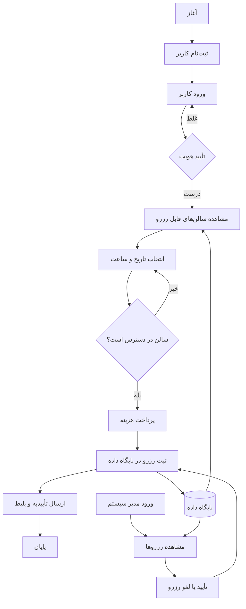

```mermaid
flowchart TD
    A[آغاز] --> B[ثبت‌نام کاربر]
    B --> C[ورود کاربر]
    C --> D{تأیید هویت}
    D -- درست --> E[مشاهده سالن‌های قابل رزرو]
    D -- غلط --> C
    E --> F[انتخاب تاریخ و ساعت]
    F --> G{سالن در دسترس است؟}
    G -- خیر --> F
    G -- بله --> H[پرداخت هزینه]
    H --> I[ثبت رزرو در پایگاه داده]
    I --> J[ارسال تأییدیه و بلیط]
    J --> K[پایان]

    %% نقش مدیر سیستم
    L[ورود مدیر سیستم] --> M[مشاهده رزروها]
    M --> N[تأیید یا لغو رزرو]
    N --> I

    %% پایگاه داده
    I --> DB[(پایگاه داده)]
    DB --> E
    DB --> M
```
